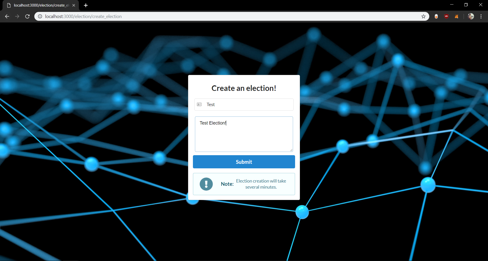
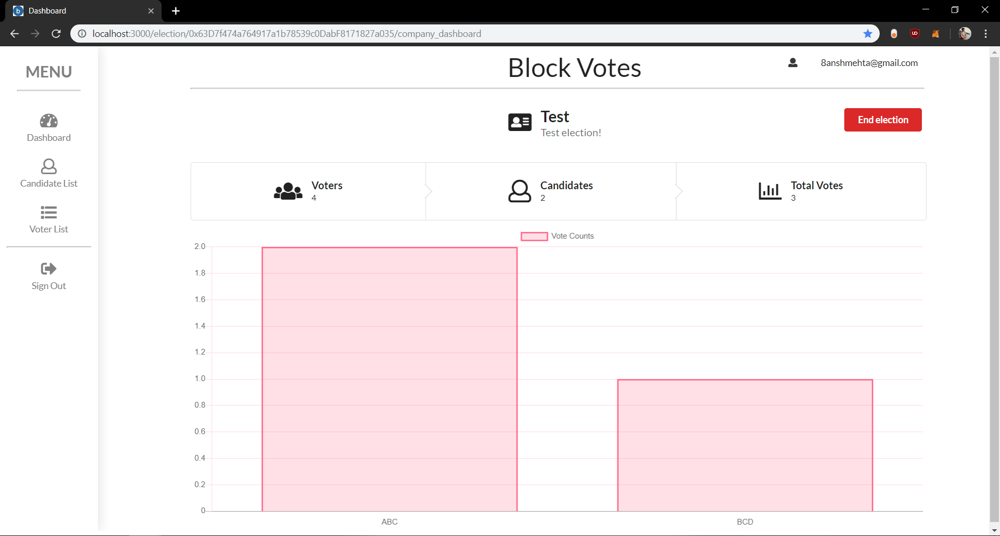
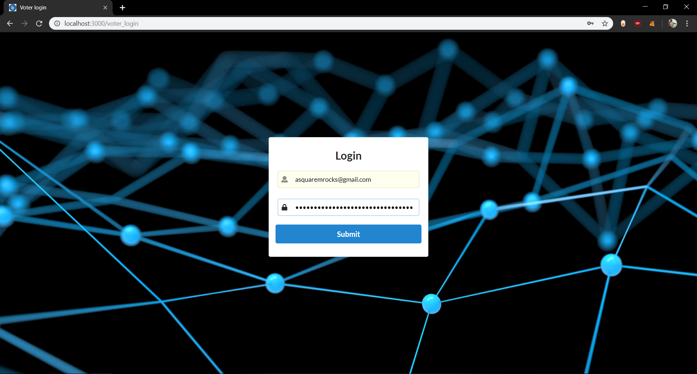

# 🗳️ VoteChain – Blockchain-Powered E-Voting System


> A secure, transparent, and tamper-proof blockchain-based voting system  
> Developed with ❤️ by **Shristi Rajpoot**

---

## 🌐 Overview

**VoteChain** is a fully decentralized e-voting platform leveraging the Ethereum blockchain, IPFS, and modern web technologies to ensure secure, auditable, and reliable elections. It enables companies or institutions to organize elections, register voters and candidates, and allow secure voting—all while maintaining transparency and trust.

---

## ✨ Features

- ✅ **Blockchain-Powered Voting** – Uses Ethereum & Solidity to secure each vote  
- 🗳️ **Election Management** – Create elections, add candidates and voters  
- 🔐 **Secure Voter Authentication** – Voters receive encrypted credentials via email  
- 📩 **Email Notifications** – Real-time email alerts for credentials, election updates & results  
- ⚡ **Instant Results** – Votes are counted automatically, and results are visible immediately  
- 🌍 **Decentralized Storage** – Candidate images and data stored via IPFS

---

## 🧱 Tech Stack

- **Frontend**: Next.js, Semantic UI React  
- **Smart Contracts**: Solidity, Web3.js  
- **Backend**: Node.js, Express.js, MongoDB  
- **File Storage**: IPFS  
- **Blockchain**: Ethereum (Tested on Rinkeby Network)

---

## 🖥️ Screenshots

📸 Real views of the VoteChain E-Voting System:

| Homepage                        | Company Login                        |
| ------------------------------- | ------------------------------------ |
|  |  |

| Create Election                        | Election Dashboard               |
| -------------------------------------- | -------------------------------- |
|  |  |

| Voter List                       | Voter Mail Notification                         |
| -------------------------------- | ----------------------------------------------- |
|  |  |


| Voter Login                        | Successful Voting                        |
| ---------------------------------- | ---------------------------------------- |
|  |  |


| Unsuccessful Voting                        | Winner Announcement Email                    |
| ------------------------------------------ | -------------------------------------------- |
|  |  |


---

## ⚙️ Setup Instructions

### 📦 Prerequisites

- Node.js (recommended v11.14.0)
- MongoDB running on `localhost:27017`
- MetaMask installed (for Ethereum interaction)
- Email credentials for notifications
- Rinkeby test ETH (for testing)

### 🔧 Installation

```bash
git clone https://github.com/Shristirajpoot/VoteChain.git
cd VoteChain
npm install
```
## 📁 Environment Setup
Create a .env file in the root directory with the following:

```env

EMAIL=your_email@example.com
PASSWORD=your_email_password
```
## 🚀 Run Locally
```bash
npm start
```
Visit http://localhost:3000 in your browser.

## 📬 Example JSON Structure for Build Status Update
```json
{
  "stat": "s",
  "proj": "E-Vote 2025",
  "build": "Phase 1",
  "usu": "Election Admin",
  "desc": "Voting completed successfully"
}
```
## 🛠️ Known Issues & Notes

- Node version other than 11.14.0 may cause issues

- Ensure MongoDB is running locally

- Use Rinkeby Faucet to get test ETH https://faucet.rinkeby.io

## 🤝 Contributing
We welcome contributions!
To contribute:

1. Fork the repository

2. Create your branch: git checkout -b feature/awesome-feature

3. Commit your changes: git commit -m "Add awesome feature"

4. Push to the branch: git push origin feature/awesome-feature

5. Submit a pull request
---

## 👩‍💻 Author
### Shristi Rajpoot
- 📧 Email: shristirajpoot369@gmail.com
- 🔗 GitHub: @Shristirajpoot

---

## 📜 License
Distributed under the **MIT License** — see [`LICENSE`](./LICENSE).

---

### ⭐ Like what you see? **Star** the repo, fork it, or open an issue — contributions welcome!
